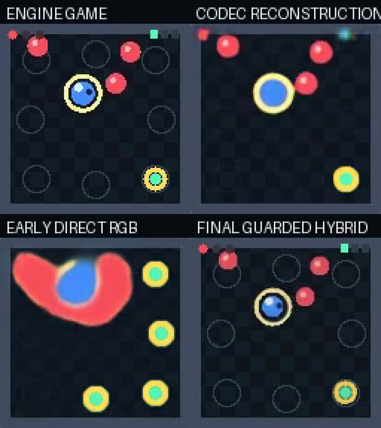
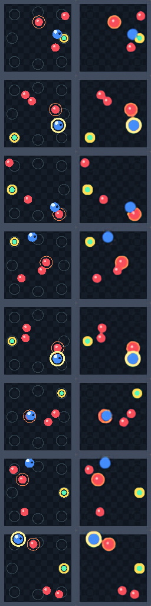

# Dreamloop

An action-conditioned, playable closed-loop world model experiment inspired by MIRA.



[Watch the 30-second progress comparison](docs/media/dreamloop-progress-30s.mp4)



The repository contains source code, tests, documentation, and selected media only. Generated datasets,
model checkpoints, latent caches, and experiment runs are intentionally excluded through `.gitignore`.

> **Artifact note:** the playable commands below expect locally generated files under `data/` and `runs/`.
> A pretrained checkpoint bundle is not published yet, so a fresh clone is currently reproducible from the
> training scripts but is not immediately playable.

## Current V12 Playable Candidate

V12 is a deterministic, observable game-world candidate built from:

- a 60k-frame, episode-safe gameplay dataset with health, win, and lose states,
- a learned `64x64` RGB state probe and learned inverse-dynamics probe,
- an action-conditioned streaming transition with a kinematic base and learned GRU residual,
- a learned differentiable RGBA sprite renderer,
- visible HUD, portal, collision flash, and terminal UI decoded from model state.

The active candidate uses a guarded learned residual. The GRU can make small corrections during clear free-space motion, while coin, collision, and wall boundaries use the deterministic kinematic core. A fully learned GRU ablation improved action following but still drifted in long rollouts, so it is not promoted. This is a hybrid world model, not a claim that a neural latent model learned all game physics.

Run the current candidate:

```bash
python scripts/play_v2_world_model.py --checkpoint runs/v12_hybrid_dynamics_motionloss/best.pt --model-type semantic --seed 2027 --fps 12 --scale 4
```

Controls: WASD/arrows move, Space dashes, R resets, E toggles engine playback, and Esc exits.

Current measured behavior on 24 held-out 10-second rollouts:

```text
self object presence:    100.00%
action following:         98.78%
runtime:                  17.76 FPS
target object presence:   99.66%
target event consistency: 98.51%
```

The model world no longer loses objects or collapses. Both the 24-seed 10-second and 60-second acceptance gates pass. The 60-second aggregate retains `99.89%` target object presence at `37.18 FPS`, with `98.70%` event consistency and no collapsed rollout.

This remains labeled a hybrid playable candidate rather than a final latent MIRA-like model: RGB-derived trajectory fitting and the kinematic core are still responsible for most long-horizon stability.

Final 30-second four-panel comparison:

```text
docs/media/dreamloop-progress-30s.mp4
```

The panels show the engine, codec reconstruction, early direct-RGB baseline, and final guarded hybrid world. The file is verified at 30 seconds, 12 FPS, and 360 frames.

The first milestone is intentionally small:

```text
game-like 128x128 frames + recent actions -> next RGB frame
```

This does not replace a real game engine yet. It proves the data and training loop for a pixel-based world model.

## Recommended First Demo: Toy Arena

For a game-developer portfolio post, start with the synthetic top-down arena. It has a player, enemies, a collectible, visible action colors, and deterministic-ish motion, so the output reads as game content instead of a physics toy.

```bash
python scripts/generate_toy_arena_npz.py --out data/toy_arena_128_50k.npz --steps 50000 --size 128
python scripts/train_next_frame.py --data data/toy_arena_128_50k.npz --epochs 8 --batch-size 32 --out-dir runs/toy_arena_128
python scripts/rollout_preview.py --data data/toy_arena_128_50k.npz --checkpoint runs/toy_arena_128/best.pt --out runs/toy_arena_128/preview.gif --steps 48
python scripts/make_post_preview.py --in runs/toy_arena_128/preview.gif --gif-out runs/toy_arena_128/post_preview.gif --mp4-out runs/toy_arena_128/post_preview.mp4
```

Use smaller smoke tests while iterating:

```bash
python scripts/generate_toy_arena_npz.py --out data/toy_arena_smoke.npz --steps 256 --size 128
python scripts/train_next_frame.py --data data/toy_arena_smoke.npz --epochs 1 --batch-size 8 --out-dir runs/toy_arena_smoke
```

## Play the World Model

After training or downloading a checkpoint to `runs/improved/best.pt`, run:

```bash
python scripts/play_world_model.py --data data/toy_arena_smoke.npz --checkpoint runs/improved/best.pt --fps 12 --scale 4
```

For the more stable closed-loop experiment, use the rollout-fine-tuned checkpoint:

```bash
python scripts/play_world_model.py --data data/toy_arena_mixed_128_4k.npz --checkpoint runs/closed_loop_stable_v5/best.pt --closed-loop --fps 12 --scale 4
```

Controls:

- Arrow keys / WASD: move
- Space: dash
- R: reseed the starting context
- E: toggle real engine playback vs model output
- M: toggle closed-loop vs engine-assisted model context
- Esc: quit

Default mode is engine-assisted: the controls update the real toy arena state, and the model predicts the next frame from that fresh history. Use `--closed-loop` only to demonstrate how quickly a one-step model drifts when it feeds on its own predictions.

To play the direct multi-frame sequence checkpoint, run the chunked sequence adapter:

```bash
python scripts/play_sequence_world_model.py --data data/toy_arena_mixed_event_128_16k.npz --checkpoint runs/sequence_model_c8_h8_player_wide_e8_gpu/best.pt --fps 12 --scale 4 --chunk-stride 2 --stabilize 0.08 --foreground-persist 0.12
```

This adapter predicts 8 future frames at a time and plays the predicted frames back in short chunks. Since live input does not provide a full future action sequence, the first adapter assumes the current action continues across the chunk, then regenerates the chunk when input changes. Press `E` to toggle engine-assisted mode, where the toy engine refreshes history instead of feeding model predictions back.

Current limitation: this is playable, but not yet as responsive as a true MIRA-style model. Fast input changes force chunk regeneration, and closed-loop chunks are still blurrier than engine frames.

To improve closed-loop stability, generate a mixed-control dataset and fine-tune with rollout loss:

```bash
python scripts/generate_toy_arena_npz.py --out data/toy_arena_mixed_128_4k.npz --steps 4000 --size 128 --policy mixed --seed 42
python scripts/train_rollout_stabilizer.py --data data/toy_arena_mixed_128_4k.npz --checkpoint runs/improved/best.pt --out-dir runs/closed_loop_stable_v2 --horizon 6 --epochs 2 --batch-size 4 --max-samples 768 --scheduled-sampling 0.85
python scripts/train_rollout_stabilizer.py --data data/toy_arena_mixed_128_4k.npz --checkpoint runs/closed_loop_stable_v2/best.pt --out-dir runs/closed_loop_stable_v3 --horizon 8 --epochs 1 --batch-size 4 --max-samples 512 --scheduled-sampling 1.0
python scripts/train_rollout_stabilizer.py --data data/toy_arena_mixed_128_4k.npz --checkpoint runs/closed_loop_stable_v3/best.pt --out-dir runs/closed_loop_stable_v4 --horizon 10 --epochs 1 --batch-size 4 --max-samples 384 --scheduled-sampling 1.0
python scripts/train_rollout_stabilizer.py --data data/toy_arena_mixed_128_4k.npz --checkpoint runs/closed_loop_stable_v4/best.pt --out-dir runs/closed_loop_stable_v5 --horizon 12 --epochs 1 --batch-size 4 --max-samples 256 --scheduled-sampling 1.0 --lr 2e-5
```

For coin/collision-heavy experiments, generate an event-heavy dataset:

```bash
python scripts/generate_toy_arena_npz.py --out data/toy_arena_event_128_8k.npz --steps 8000 --size 128 --policy event --seed 108
```

The local V8 event dataset produced:

```text
policy=event coin_collects=601 enemy_contacts=3654 event_respawn_rate=0.70
```

Render a side-by-side closed-loop comparison:

```bash
python scripts/render_closed_loop_eval.py --base runs/improved/best.pt --stable runs/closed_loop_stable_v5/best.pt --steps 180 --fps 12 --out runs/closed_loop_eval/base_vs_v5_ramp2035_180.mp4
```

Run a multi-seed aggregate eval without rendering video:

```bash
python scripts/render_closed_loop_eval.py --base runs/improved/best.pt --stable runs/closed_loop_stable_v5/best.pt --steps 120 --seeds 2026,7,99 --action-mode mixed --no-video
```

Current local single-video eval result:

```text
base_closed_loop_mse=0.085666
stable_closed_loop_mse=0.024418
```

Current local aggregate eval results:

```text
scripted actions: base=0.059685 stable=0.022663
mixed actions:    base=0.070349 stable=0.022039
random actions:   base=0.059936 stable=0.023171
```

The active inference blend ramps from `--stabilize 0.20` to `--stabilize-end 0.35` over `120` closed-loop frames, selected from a small grid search across scripted, mixed, and random action modes.
Small-object persistence is also enabled by default with `--foreground-persist 0.12`. This is a light inference-only guard for coins/player/enemy pixels that prevents a bright or saturated object from vanishing in one autoregressive step without switching to a new checkpoint.

Foreground-persistence 120-step aggregate eval:

```text
scripted actions: stable_mse=0.022184 foreground_mse=0.272639
mixed actions:    stable_mse=0.022018 foreground_mse=0.279204
random actions:   stable_mse=0.023212 foreground_mse=0.290195
```

Longer 300-step aggregate eval confirms the same stability trend:

```text
scripted actions: base=0.138331 stable=0.023697
mixed actions:    base=0.155006 stable=0.023101
random actions:   base=0.146824 stable=0.023556
```

V6 was tested with a mixed+random dataset and rejected because it regressed against V5:

```text
scripted actions: v5=0.022641 v6=0.023028
mixed actions:    v5=0.022532 v6=0.022829
random actions:   v5=0.023238 v6=0.023451
```

V7 foreground-weighted fine-tuning was tested to preserve coins/collision objects, but rejected as the default because it improved foreground error while heavily regressing full-frame stability:

```text
scripted actions: v5=0.022663 v7=0.078646 foreground v5=0.274187 v7=0.163887
mixed actions:    v5=0.022039 v7=0.089513 foreground v5=0.280135 v7=0.168414
random actions:   v5=0.023171 v7=0.100701 foreground v5=0.291029 v7=0.182111
```

V8/V9/V10 used the event-heavy data to test whether more targeted training fixes disappearing coins and collision artifacts. They are kept as research checkpoints, not active demo checkpoints:

```text
V8 event-only fg=0.75:
scripted actions: v5=0.022184 v8=0.030972 foreground v5=0.272639 v8=0.204198
mixed actions:    v5=0.022018 v8=0.036191 foreground v5=0.279204 v8=0.228118
random actions:   v5=0.023212 v8=0.030059 foreground v5=0.290195 v8=0.261505
event actions:    v5=0.022722 v8=0.034323 foreground v5=0.285663 v8=0.241852

V9 mixed+event fg=0.25:
scripted actions: v5=0.022184 v9=0.025684 foreground v5=0.272639 v9=0.254564
mixed actions:    v5=0.022018 v9=0.024961 foreground v5=0.279204 v9=0.274207
random actions:   v5=0.023212 v9=0.023597 foreground v5=0.290195 v9=0.287358
event actions:    v5=0.022722 v9=0.024716 foreground v5=0.285663 v9=0.283793

V10 mixed+event fg=0.10:
scripted actions: v5=0.022184 v10=0.024510 foreground v5=0.272639 v10=0.258182
mixed actions:    v5=0.022018 v10=0.027466 foreground v5=0.279204 v10=0.268939
random actions:   v5=0.023212 v10=0.023814 foreground v5=0.290195 v10=0.290367
event actions:    v5=0.022722 v10=0.024875 foreground v5=0.285663 v10=0.284814
```

Takeaway: more event-heavy training helps foreground objects, but the current one-step pixel model pays for it with worse full-frame stability. The active demo stays on V5 plus light `--foreground-persist 0.12`.

## Direct Multi-Frame Sequence Model

The one-step model predicts:

```text
context frames + one action -> next frame
```

MIRA-like training needs a longer temporal target. The experimental sequence model predicts:

```text
8 context frames + 8 future actions -> 8 future frames
```

This is not wired into the real-time pygame demo yet. It is a separate research path for testing whether a longer objective preserves coins, contacts, and short-term motion better than one-step pixel prediction.

Smoke-train the sequence model:

```bash
python scripts/train_sequence_model.py --data data/toy_arena_mixed_event_128_16k.npz --out-dir runs/sequence_model_smoke_c8_h8 --context 8 --horizon 8 --epochs 1 --batch-size 4 --max-samples 256 --sample-seed 808 --lr 2e-4 --foreground-weight 0.25 --temporal-weight 0.25
```

Render teacher-forced and chunk closed-loop previews:

```bash
python scripts/sequence_rollout_preview.py --data data/toy_arena_mixed_event_128_16k.npz --checkpoint runs/sequence_model_smoke_c8_h8/best.pt --out runs/sequence_model_smoke_c8_h8/sequence_preview.gif --metrics-out runs/sequence_model_smoke_c8_h8/sequence_preview_metrics.json --start 120 --chunks 2 --fps 12
python scripts/sequence_rollout_preview.py --data data/toy_arena_mixed_event_128_16k.npz --checkpoint runs/sequence_model_smoke_c8_h8/best.pt --out runs/sequence_model_smoke_c8_h8/sequence_closed_loop_preview.gif --metrics-out runs/sequence_model_smoke_c8_h8/sequence_closed_loop_metrics.json --start 120 --chunks 2 --closed-loop --fps 12
```

Current smoke result:

```text
context=8 horizon=8 chunks=2
teacher-forced: mse=0.026546 foreground_mse=0.282969
chunk closed-loop: mse=0.026508 foreground_mse=0.282796
```

A larger CPU-friendly sequence run:

```bash
python scripts/train_sequence_model.py --data data/toy_arena_mixed_event_128_16k.npz --out-dir runs/sequence_model_c8_h8_2k_e3 --context 8 --horizon 8 --epochs 3 --batch-size 4 --max-samples 2048 --sample-seed 1808 --lr 2e-4 --foreground-weight 0.25 --temporal-weight 0.25
```

Result:

```text
epoch=1 sequence_train_loss=0.027801 sequence_val_loss=0.017987
epoch=2 sequence_train_loss=0.015962 sequence_val_loss=0.014616
epoch=3 sequence_train_loss=0.013822 sequence_val_loss=0.013115
```

Preview metrics over 3 chunks, 24 predicted frames:

```text
mixed/event region, teacher-forced: mse=0.008638 foreground_mse=0.091765
mixed/event region, chunk closed-loop: mse=0.013366 foreground_mse=0.146367
event-heavy region, teacher-forced: mse=0.009065 foreground_mse=0.104205
event-heavy region, chunk closed-loop: mse=0.012756 foreground_mse=0.158749
```

Artifacts:

```text
runs/sequence_model_c8_h8_2k_e3/best.pt
runs/sequence_model_c8_h8_2k_e3/sequence_preview.gif
runs/sequence_model_c8_h8_2k_e3/sequence_closed_loop_preview.gif
runs/sequence_model_c8_h8_2k_e3/sequence_event_preview.gif
runs/sequence_model_c8_h8_2k_e3/sequence_event_closed_loop_preview.gif
```

This is the first result that strongly supports the multi-frame objective. The active pygame demo still uses V5 because the sequence checkpoint needs a chunked playable adapter before it can replace the one-step model in real time.

The same `2048 sample / 3 epoch` sequence run on the local RTX 5060 Laptop GPU completed in `44.8s` after installing CUDA PyTorch:

```text
torch=2.11.0+cu128
cuda_available=True
cuda_version=12.8
device=NVIDIA GeForce RTX 5060 Laptop GPU
gpu run: 44.8s
gpu checkpoint val_loss=0.014530
gpu teacher-forced: mse=0.009985 foreground_mse=0.101166
gpu chunk closed-loop: mse=0.015115 foreground_mse=0.140044
```

Artifacts:

```text
runs/sequence_model_c8_h8_2k_e3_gpu/best.pt
runs/sequence_model_c8_h8_2k_e3_gpu/sequence_preview.gif
runs/sequence_model_c8_h8_2k_e3_gpu/sequence_closed_loop_preview.gif
```

Next useful experiment is a real run with 5k-20k samples and 5-10 epochs, then a chunked playable loop if the previews retain small objects better than V5.

The first larger visual QA run used the local RTX 5060 with `10k samples / 5 epochs / batch-size 8`:

```bash
python scripts/train_sequence_model.py --data data/toy_arena_mixed_event_128_16k.npz --out-dir runs/sequence_model_c8_h8_10k_e5_gpu --context 8 --horizon 8 --epochs 5 --batch-size 8 --max-samples 10000 --sample-seed 10108 --lr 2e-4 --foreground-weight 0.25 --temporal-weight 0.25
```

Training time was `323.96s` on the local RTX 5060. Best checkpoint:

```text
runs/sequence_model_c8_h8_10k_e5_gpu/best.pt
epoch=5 val_loss=0.010137
```

Video QA metrics over 4 chunks, 32 predicted frames:

```text
mixed teacher-forced: mse=0.005608 foreground_mse=0.063409
mixed chunk closed-loop: mse=0.011317 foreground_mse=0.129401
event teacher-forced: mse=0.008601 foreground_mse=0.095437
event chunk closed-loop: mse=0.012788 foreground_mse=0.168418
```

Video and screenshot artifacts:

```text
runs/sequence_model_c8_h8_10k_e5_gpu/sequence_mixed_tf.mp4
runs/sequence_model_c8_h8_10k_e5_gpu/sequence_mixed_closed_loop.mp4
runs/sequence_model_c8_h8_10k_e5_gpu/sequence_event_tf.mp4
runs/sequence_model_c8_h8_10k_e5_gpu/sequence_event_closed_loop.mp4
runs/sequence_model_c8_h8_10k_e5_gpu/sequence_contact_sheet.png
```

Visual read: the sequence model keeps the major objects and coin/enemy blobs present across the rollout, especially in teacher-forced mode. The current weakness is sprite sharpness: predictions are still visibly blurred compared with the engine frames, and event-heavy chunk closed-loop drifts more than mixed teacher-forced. This supports moving to a chunked playable adapter, but the next model upgrade should add sharper reconstruction pressure or a latent/autoencoder path.

The active playable sequence checkpoint was then fine-tuned from the 10k model with rollout-aware chunk training. This trains the model on three predicted chunks in a row, using fully predicted history between chunks, so the loss better matches the closed-loop failure mode:

```bash
python scripts/train_sequence_model.py --data data/toy_arena_mixed_event_128_16k.npz --checkpoint runs/sequence_model_c8_h8_10k_e5_gpu/best.pt --out-dir runs/sequence_model_c8_h8_rollout3_e4_gpu --context 8 --horizon 8 --rollout-chunks 3 --epochs 4 --batch-size 8 --max-samples 8000 --sample-seed 30308 --scheduled-sampling 1.0 --lr 5e-5 --foreground-weight 0.25 --temporal-weight 0.25
```

Training time was `512.06s` on the local RTX 5060. Best checkpoint:

```text
runs/sequence_model_c8_h8_rollout3_e4_gpu/best.pt
epoch=4 rollout_val_loss=0.019022
```

Same 4-chunk video QA after rollout fine-tuning:

```text
mixed teacher-forced: mse=0.005582 foreground_mse=0.056651
mixed chunk closed-loop: mse=0.010311 foreground_mse=0.106766
event teacher-forced: mse=0.008632 foreground_mse=0.091028
event chunk closed-loop: mse=0.011465 foreground_mse=0.131057
```

Video and screenshot artifacts:

```text
runs/sequence_model_c8_h8_rollout3_e4_gpu/sequence_mixed_tf.mp4
runs/sequence_model_c8_h8_rollout3_e4_gpu/sequence_mixed_closed_loop.mp4
runs/sequence_model_c8_h8_rollout3_e4_gpu/sequence_event_tf.mp4
runs/sequence_model_c8_h8_rollout3_e4_gpu/sequence_event_closed_loop.mp4
runs/sequence_model_c8_h8_rollout3_e4_gpu/sequence_contact_sheet.png
```

Visual read: closed-loop stability is better than the 10k teacher-forced checkpoint, especially for event-heavy foreground persistence, but predictions are still soft and drift over a long autoregressive rollout. This became the first chunked playable checkpoint because it improved the exact failure mode without changing the runtime adapter.

The next active checkpoint adds a player-blue-specific loss term. The foreground mask helped coins and saturated objects, but the player sprite is mostly blue and needed its own color-targeted weight:

```bash
python scripts/train_sequence_model.py --data data/toy_arena_mixed_event_128_16k.npz --checkpoint runs/sequence_model_c8_h8_rollout3_e4_gpu/best.pt --out-dir runs/sequence_model_c8_h8_player_wide_e8_gpu --context 8 --horizon 8 --rollout-chunks 3 --epochs 8 --batch-size 16 --sample-seed 60608 --scheduled-sampling 1.0 --lr 1e-5 --foreground-weight 0.25 --player-weight 1.25 --temporal-weight 0.20
```

Best checkpoint:

```text
runs/sequence_model_c8_h8_player_wide_e8_gpu/best.pt
epoch=8 rollout_val_loss=0.020683
```

Same 4-chunk video QA with the added `player_mse` metric:

```text
mixed teacher-forced: mse=0.005533 foreground_mse=0.054723 player_mse=0.038801
mixed chunk closed-loop: mse=0.009333 foreground_mse=0.096712 player_mse=0.048376
event teacher-forced: mse=0.008750 foreground_mse=0.087867 player_mse=0.066824
event chunk closed-loop: mse=0.011081 foreground_mse=0.124817 player_mse=0.099516
```

Compared with the previous active rollout3 checkpoint, closed-loop player error improved from `0.097303 -> 0.048376` on the mixed sample and `0.157642 -> 0.099516` on the event-heavy sample. This is now the active playable sequence checkpoint.

Video and screenshot artifacts:

```text
runs/sequence_model_c8_h8_player_wide_e8_gpu/sequence_mixed_tf.mp4
runs/sequence_model_c8_h8_player_wide_e8_gpu/sequence_mixed_closed_loop.mp4
runs/sequence_model_c8_h8_player_wide_e8_gpu/sequence_event_tf.mp4
runs/sequence_model_c8_h8_player_wide_e8_gpu/sequence_event_closed_loop.mp4
runs/sequence_model_c8_h8_player_wide_e8_gpu/sequence_contact_sheet.png
```

Two follow-up fine-tunes were tested and kept as research artifacts, not active demo checkpoints:

```text
runs/sequence_model_c8_h8_rollout4_fg_e3_gpu/best.pt
mixed chunk closed-loop: mse=0.009600 foreground_mse=0.102665
event chunk closed-loop: mse=0.011585 foreground_mse=0.137912

runs/sequence_model_c8_h8_event_focus_e2_gpu/best.pt
mixed chunk closed-loop: mse=0.010034 foreground_mse=0.110913
event chunk closed-loop: mse=0.011398 foreground_mse=0.137802
```

The rollout4 foreground run improved mixed closed-loop but regressed event/collision foreground. The event-focused run improved aggregate MSE slightly but worsened foreground persistence. Both remain research checkpoints; the active demo has moved to the player-blue-weighted checkpoint above.

## Latent World Model Path

The next research path is closer to MIRA's structure: train a frame autoencoder, freeze it, then train action-conditioned dynamics in latent space instead of predicting RGB directly.

Smoke commands:

```bash
python scripts/train_autoencoder.py --data data/toy_arena_mixed_event_128_16k.npz --out-dir runs/autoencoder_smoke_l64 --epochs 1 --batch-size 16 --max-samples 128 --sample-seed 7001 --latent-channels 64 --lr 2e-4 --foreground-weight 0.35 --player-weight 1.25 --edge-weight 0.10
python scripts/train_latent_dynamics.py --data data/toy_arena_mixed_event_128_16k.npz --autoencoder runs/autoencoder_smoke_l64/best.pt --out-dir runs/latent_dynamics_smoke --context 8 --horizon 8 --rollout-chunks 2 --epochs 1 --batch-size 4 --max-samples 64 --sample-seed 7002 --scheduled-sampling 1.0 --lr 1e-4 --latent-weight 1.0 --decoded-weight 0.35 --foreground-weight 0.35 --player-weight 1.25
python scripts/latent_rollout_preview.py --data data/toy_arena_mixed_event_128_16k.npz --checkpoint runs/latent_dynamics_smoke/best.pt --out runs/latent_dynamics_smoke/latent_closed_loop_smoke.mp4 --metrics-out runs/latent_dynamics_smoke/latent_closed_loop_smoke_metrics.json --start 120 --chunks 1 --closed-loop --fps 12
python scripts/play_latent_world_model.py --data data/toy_arena_mixed_event_128_16k.npz --checkpoint runs/latent_dynamics_smoke/best.pt --fps 12 --scale 2 --max-frames 3
```

Full-run defaults:

```bash
python scripts/train_autoencoder.py --data data/toy_arena_mixed_event_128_16k.npz --out-dir runs/autoencoder_l64_16x16_e20_gpu --epochs 20 --batch-size 64 --latent-channels 64 --lr 2e-4 --foreground-weight 0.35 --player-weight 1.25 --edge-weight 0.10
python scripts/train_latent_dynamics.py --data data/toy_arena_mixed_event_128_16k.npz --autoencoder runs/autoencoder_l64_16x16_e20_gpu/best.pt --out-dir runs/latent_dynamics_c8_h8_e20_gpu --context 8 --horizon 8 --rollout-chunks 3 --epochs 20 --batch-size 16 --scheduled-sampling 1.0 --lr 1e-4 --latent-weight 1.0 --decoded-weight 0.35 --foreground-weight 0.35 --player-weight 1.25
```

Full latent checkpoints should only replace the active RGB sequence demo if 4-chunk closed-loop QA beats the current active baseline:

```text
mixed closed-loop player_mse < 0.048376
event closed-loop player_mse < 0.099516
foreground_mse must not regress by more than 5%
```

Current full latent run status:

```text
autoencoder: runs/autoencoder_l64_16x16_e20_gpu/best.pt
autoencoder epoch=20 val_loss=0.016890
autoencoder QA avg_mse=0.004287 avg_foreground_mse=0.040881 avg_player_mse=0.004135

latent dynamics: runs/latent_dynamics_c8_h8_e20_gpu/best.pt
epoch=3 latent_val_loss=2.283144
```

Epoch-3 latent dynamics is only an early checkpoint. Its 4-chunk closed-loop player metric is promising, but foreground has not passed the active-demo gate:

```text
mixed closed-loop: mse=0.013134 foreground_mse=0.154194 player_mse=0.029272
event closed-loop: mse=0.016858 foreground_mse=0.214635 player_mse=0.088340
```

Visual read: the latent model preserves the blue player better than the RGB sequence model, but coin rings/cyan details and enemy layout drift too much at epoch 3. Continue training before deciding whether to activate the latent demo.

Epoch-5 checkpoint continued improving latent validation loss, but still did not pass the event closed-loop activation gate:

```text
epoch=5 latent_val_loss=1.968627
mixed closed-loop: mse=0.011764 foreground_mse=0.143861 player_mse=0.021217
event closed-loop: mse=0.016627 foreground_mse=0.214826 player_mse=0.109185
```

Decision: keep training and do not switch the active playable demo yet. The latent path is clearly better at preserving the blue player in mixed rollouts, but event/collision foreground drift remains too high.

Epoch-7 improved the event player metric enough to pass the player-only gate, but foreground still blocks activation:

```text
epoch=7 latent_val_loss=1.860451
mixed closed-loop: mse=0.011303 foreground_mse=0.129751 player_mse=0.021848
event closed-loop: mse=0.016375 foreground_mse=0.212220 player_mse=0.069218
```

Visual read: blue-player persistence is now clearly better than the RGB sequence baseline, but the latent dynamics model still loses coin/enemy spatial detail in longer event rollouts. Continue the full run and reassess after later epochs.

Epoch-9 continued the same trend: player preservation is strong, mixed foreground is close, but event foreground is still too high for activation:

```text
epoch=9 latent_val_loss=1.658833
mixed teacher-forced: mse=0.007514 foreground_mse=0.079725 player_mse=0.016247
mixed closed-loop: mse=0.010088 foreground_mse=0.109508 player_mse=0.022747
event teacher-forced: mse=0.011371 foreground_mse=0.144787 player_mse=0.023555
event closed-loop: mse=0.014098 foreground_mse=0.184992 player_mse=0.045211
```

Decision remains unchanged: keep the RGB sequence checkpoint as active playable demo until event foreground drift is much closer to the baseline.

Epoch-11 did not beat epoch-9 on the activation metrics despite a slightly better validation loss:

```text
epoch=11 latent_val_loss=1.641686
mixed closed-loop: mse=0.010870 foreground_mse=0.112817 player_mse=0.042815
event closed-loop: mse=0.014750 foreground_mse=0.189578 player_mse=0.061720
```

This suggests the current latent loss is improving average validation loss without reliably improving the 4-chunk event foreground gate. The active demo should still stay on the RGB sequence model unless later epochs reverse this trend.

Epoch-13 improved validation loss but still did not clear event foreground:

```text
epoch=13 latent_val_loss=1.523757
mixed teacher-forced: mse=0.007681 foreground_mse=0.083825 player_mse=0.023250
mixed closed-loop: mse=0.010736 foreground_mse=0.117795 player_mse=0.039044
event teacher-forced: mse=0.011480 foreground_mse=0.150296 player_mse=0.019136
event closed-loop: mse=0.014278 foreground_mse=0.186953 player_mse=0.037954
```

The trainer now supports `--checkpoint`, `--index-start`, and `--index-end` so the next targeted run can fine-tune from the best full latent checkpoint on event-heavy sequences with stronger decoded foreground pressure:

```bash
python scripts/train_latent_dynamics.py --data data/toy_arena_mixed_event_128_16k.npz --autoencoder runs/autoencoder_l64_16x16_e20_gpu/best.pt --checkpoint runs/latent_dynamics_c8_h8_e20_gpu/best.pt --out-dir runs/latent_dynamics_event_focus_fg_e4_gpu --context 8 --horizon 8 --rollout-chunks 3 --epochs 4 --batch-size 16 --index-start 8000 --scheduled-sampling 1.0 --lr 2e-5 --latent-weight 1.0 --decoded-weight 0.75 --foreground-weight 0.75 --player-weight 1.25
```

Epoch-14 made mixed closed-loop competitive but still did not solve event foreground:

```text
epoch=14 latent_val_loss=1.458232
mixed closed-loop: mse=0.009614 foreground_mse=0.108429 player_mse=0.019799
event closed-loop: mse=0.014060 foreground_mse=0.185381 player_mse=0.030045
```

Decision: the full latent run should continue to completion, but unless event foreground improves sharply in later epochs, run the event-focused fine-tune above before considering the latent model for the active demo.

Epoch-15 further improved mixed closed-loop and player stability, but event foreground remains the blocker:

```text
epoch=15 latent_val_loss=1.445126
mixed closed-loop: mse=0.009168 foreground_mse=0.101147 player_mse=0.023860
event closed-loop: mse=0.013942 foreground_mse=0.182420 player_mse=0.030834
```

The full run is now clearly useful as a source checkpoint, but the active-demo decision should wait for either final epoch QA or the event-focused fine-tune.

Palette snapping was also tested as an optional inference post-process and rejected as a default because it increased aggregate error:

```text
palette_snap=0.00 avg=0.022624
palette_snap=0.05 avg=0.023007
palette_snap=0.10 avg=0.023429
palette_snap=0.20 avg=0.023879
```

## Why generate local CoinRun data first?

The public `p-doom/coinrun-dataset` Hugging Face dataset is useful, but it is about 63.6 GB and stored in ArrayRecord for Jasmine/JAX. For the first prototype, generating a small `.npz` dataset from Procgen is faster and easier to debug in Colab.

Dataset reference: https://huggingface.co/datasets/p-doom/coinrun-dataset

## Local Setup

Procgen's published wheels target Python 3.7-3.10. If your local Python is newer, use Colab with a compatible runtime, a Python 3.10 environment, or skip Procgen generation and use a prebuilt `.npz`.

```bash
python -m venv .venv
.venv\Scripts\activate
pip install -r requirements.txt
```

On Colab, install the same requirements with:

```bash
pip install -r requirements.txt
```

For local NVIDIA GPU training on Windows, install CUDA-enabled PyTorch from the official PyTorch wheel index. The local RTX 5060 setup was:

```bash
python -m pip install --force-reinstall torch==2.11.0+cu128 torchvision==0.26.0+cu128 torchaudio==2.11.0+cu128 --index-url https://download.pytorch.org/whl/cu128
```

Verify CUDA access:

```bash
python -c "import torch; print(torch.__version__); print(torch.cuda.is_available()); print(torch.version.cuda); print(torch.cuda.get_device_name(0))"
```

CoinRun/Procgen is optional now. Install it only if you specifically want the Procgen route:

```bash
pip install -r requirements-procgen.txt
```

If `procgen` fails to install because the Colab Python version is too new, stay on the toy arena path or switch to a Python 3.10 runtime/container.

## 1. Generate a Small Dataset

```bash
python scripts/generate_coinrun_npz.py --out data/coinrun_20k.npz --steps 20000 --num-envs 8
```

If Procgen cannot install in your runtime, use the toy side-scroller fallback to verify the ML loop:

```bash
python scripts/generate_toy_runner_npz.py --out data/toy_runner_20k.npz --steps 20000
python scripts/train_next_frame.py --data data/toy_runner_20k.npz --epochs 5 --batch-size 64
python scripts/rollout_preview.py --data data/toy_runner_20k.npz --checkpoint runs/coinrun_next_frame/best.pt
```

For a non-game physics-video world model, generate a controlled double pendulum dataset:

```bash
python scripts/generate_double_pendulum_npz.py --out data/double_pendulum_50k.npz --steps 50000
python scripts/train_next_frame.py --data data/double_pendulum_50k.npz --epochs 10 --batch-size 128 --out-dir runs/double_pendulum
python scripts/rollout_preview.py --data data/double_pendulum_50k.npz --checkpoint runs/double_pendulum/best.pt --out runs/double_pendulum/preview.gif --steps 48
```

This keeps the same action-conditioned setup, but the "actions" are small torque kicks applied to the pendulum joints.

All generators store the same format:

```text
frames:  uint8 [T, H, W, 3]
actions: int64 [T]
dones:   bool  [T]
```

## 2. Train Next-Frame Model

```bash
python scripts/train_next_frame.py --data data/coinrun_20k.npz --epochs 5 --batch-size 64
```

Outputs go to `runs/coinrun_next_frame/`.

## 3. Render a Rollout Preview

```bash
python scripts/rollout_preview.py --data data/coinrun_20k.npz --checkpoint runs/coinrun_next_frame/best.pt --out runs/coinrun_next_frame/rollout.gif
```

The preview compares predicted frames against real frames from the held-out sequence. This is not a closed-loop playable simulator yet; it is the first sanity check before autoregressive rollout.

## Colab Starting Point

Use the notebook checklist in `notebooks/colab_start.md`. Keep the first run small: 20k-100k transitions, 128x128 or lower, 4-frame context.
